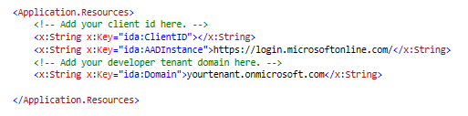

# 使用 Microsoft Graph 的 Office 365 Connect 範例 (適用於 UWP)

**目錄**  

* [簡介](#introduction)  
* [必要條件](#prerequisites)  
* [尋找系統指派的重新導向 URI](#redirect)  
* [註冊和設定應用程式](#register)  
* [建置和偵錯](#build)  
* [問題與意見](#questions)  
* [其他資源](#additional-resources)  

<a name="introduction"></a>
##簡介

此範例示範如何使用 Microsoft Graph API (之前稱為 Office 365 統一 API) 將 Windows 10 Universal 應用程式連接到 Office 365，以便傳送電子郵件。它也會使用新的 Windows 10 [WebAccountManager API](http://blogs.technet.com/b/ad/archive/2015/08/03/develop-windows-universal-apps-with-azure-ad-and-the-windows-10-identity-api.aspx) 來驗證您租用戶中的使用者。

> 注意事項： 若要了解在 UWP 應用程式中用於呼叫 Microsoft Graph 的程式碼，請參閱[在 Universal Windows 10 應用程式中呼叫 Microsoft Graph](https://graph.microsoft.io/docs/platform/uwp)。


<a name="prerequisites"></a>
## 必要條件 ##

**注意事項：** 嘗試可簡化註冊的 [Office 365 API 入門](http://dev.office.com/getting-started/office365apis?platform=option-windowsuniversal#setup)頁面，以便您更快速地執行這個範例。

此範例需要下列項目：

  * Visual Studio 2015 
  * Windows 10 ([已啟用開發模式](https://msdn.microsoft.com/zh-twlibrary/windows/apps/xaml/dn706236.aspx))
  * 適用於商務帳戶的 Office 365。您可以註冊 [Office 365 開發人員訂用帳戶](https://msdn.microsoft.com/en-us/office/office365/howto/setup-development-environment#bk_Office365Account)，其中包含開始建置 Office 365 應用程式所需的資源。
  * 用來註冊您的應用程式的 Microsoft Azure 租用戶。Azure Active Directory (AD) 會提供識別服務，以便應用程式用於驗證和授權。在這裡可以取得試用版的訂用帳戶： [Microsoft Azure](http://aka.ms/jjm0q7)。

**重要事項**： 您還需要確定您的 Azure 訂用帳戶已繫結至您的 Office 365 租用戶。若要這樣做，請參閱[建立 Office 365 帳戶與 Azure AD 的關聯以便建立和管理應用程式](https://msdn.microsoft.com/en-us/office/office365/howto/setup-development-environment#bk_CreateAzureSubscription)，以取得詳細資訊。

<a name="redirect"></a>
## 為應用程式尋找系統指派的重新導向 URI

您必須先找出應用程式的重新導向 URI，才可以在 Azure 入口網站中註冊應用程式。Windows 10 會提供唯一的 URI 給每個應用程式，並確保傳送至該 URI 的訊息只會傳送至該應用程式。若要判斷您專案的重新導向 URI：

1. 在 Visual Studio 2015 中開啟解決方案。 
2. 請確定您的 [平台目標] 設定為 x86 或 x64。
3. 按 F5。
4. 啟動應用程式之後，請選擇位於應用程式左上方功能表中的 [複製] 按鈕 。這會將應用程式的重新導向 URI 複製到剪貼簿。 
5. 儲存這個值。您將會在註冊應用程式時使用該值 (如下一節所述)。 


重新導向 URI 值如下所示：
```
ms-appx-web://Microsoft.AAD.BrokerPlugIn/S-1-15-2-694665007-945573255-503870805-3898041910-4166806349-50292026-2305040851
```


<a name="register"></a>
##註冊和設定應用程式

1.	使用 Azure AD 認證登入 [Azure 管理入口網站](http://aka.ms/i5b8dz)。
2.	按一下左邊功能表上的 [Active Directory]，然後選取您的 Office 365 開發人員網站的目錄。
3.	按一下頂端功能表上的 [應用程式]。
4.	按一下底部功能表中的 [新增]。
5.	在 [您想要做什麼] 頁面上，按一下 [新增我的組織正在開發的應用程式]。
6.	在 [告訴我們您的應用程式] 頁面上，選取 [原生用戶端應用程式] 類型及指定應用程式的名稱，例如 **O365-UWP-Connect**。
7.	按一下頁面右下角的箭號圖示。
8.	在 [應用程式資訊] 頁面上，輸入您在前一個步驟取得的重新導向 URI 值。
9.	一旦成功新增應用程式，您就會進入應用程式的 [快速入門] 頁面。從這裡選取頂端功能表中的 [設定]。
10.	在 [其他應用程式的權限] 之下選取 [新增應用程式]。在對話方塊中選取 [Microsoft Graph] 應用程式。回到應用程式設定頁面之後，請選取 [以使用者身分傳送郵件] 和 [登入和讀取使用者設定檔] 權限。
11.	在 [設定] 頁面上複製為 [用戶端識別碼] 指定的值。
12.	按一下底部功能表中的 [儲存]。

<a name="build"></a>
## 建置和偵錯 ##

**注意事項：** 如果您在步驟 2 安裝封裝時看到任何錯誤，請確定您放置解決方案的本機路徑不會太長/太深。將解決方案移靠近您的磁碟機根目錄可解決這個問題。

1. 在 Visual Studio 中載入解決方案之後，請將範例設定成使用您在 Azure Active Directory 中註冊的用戶端識別碼和您租用戶的網域，其方法是在 App.xaml 檔案的 Application.Resources 節點中加入這些索引鍵的對應值。


2. 按 F5 進行建置和偵錯。執行解決方案並使用您組織的帳戶登入 Office 365。


<a name="questions"></a>
## 問題與意見

我們很樂於收到您對於 UWP Microsoft Graph Connect 專案的意見反應。您可以在此儲存機制的[問題](https://github.com/OfficeDev/O365-UWP-Microsoft-Graph-Connect/issues)區段中，將您的問題及建議傳送給我們。

我們很重視您的意見。請透過 [Stack Overflow](http://stackoverflow.com/questions/tagged/office365+or+microsoftgraph) 與我們連絡。以 [MicrosoftGraph] 和 [office365] 標記您的問題。

<a name="additional-resources"></a>
## 其他資源 ##

- [其他 Office 365 Connect 範例](https://github.com/OfficeDev?utf8=%E2%9C%93&query=-Connect)  
- [Microsoft Graph 概觀](http://graph.microsoft.io)  
- [Office 365 API 平台概觀](https://msdn.microsoft.com/office/office365/howto/platform-development-overview)  
- [Office 365 API 程式碼範例和影片](https://msdn.microsoft.com/office/office365/howto/starter-projects-and-code-samples)  
- [Office 開發人員程式碼範例](http://dev.office.com/code-samples)  
- [Office 開發中心](http://dev.office.com/)  


## 著作權
Copyright (c) 2015 Microsoft.著作權所有，並保留一切權利。


